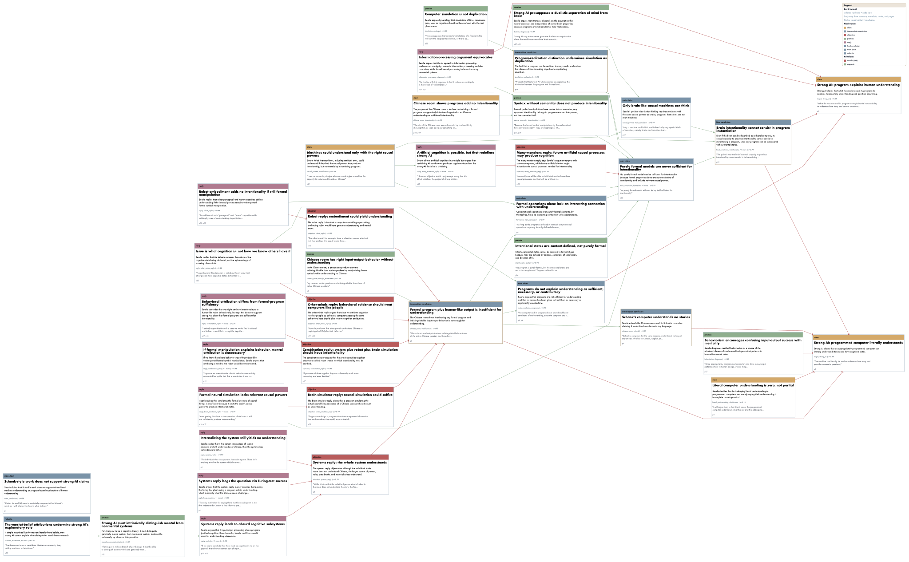
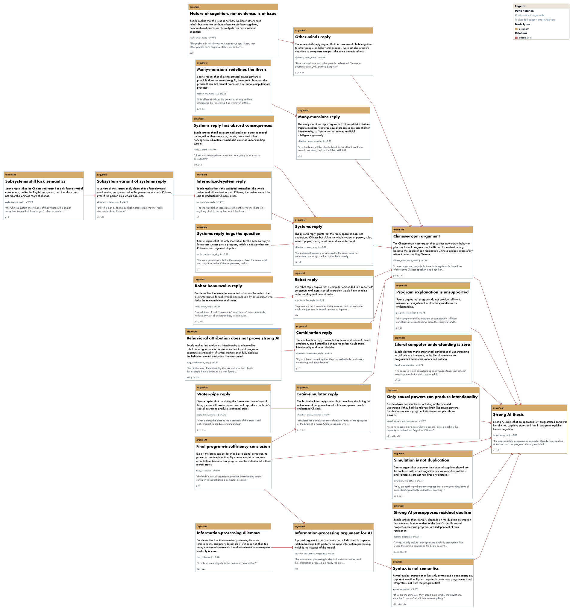
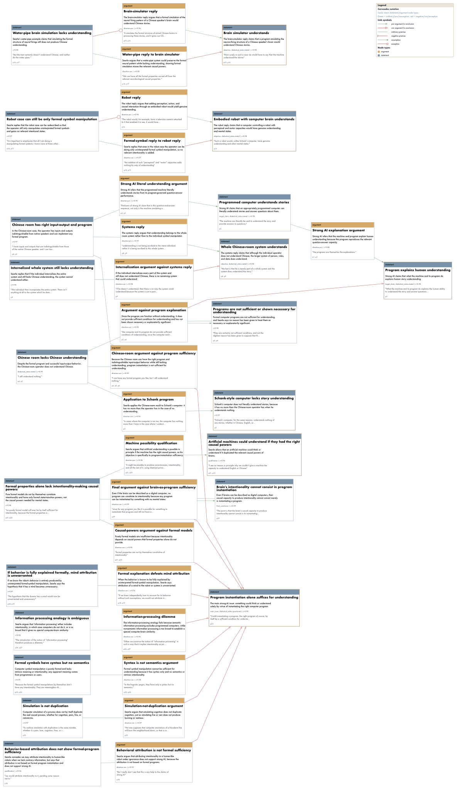

# Agentic LLMs for Argument Mining in Philosophical Texts {layout="title" data-gp-kicker="HAI-WORKSHOP / ESDiT" data-gp-code="Agentic LLMs for Argument Mining in Philosophical Texts" data-gp-section="Title"}

::: {.gp-subtitle}
HAI-Workshop 'Symbolic and Neuro-Symbolic AI: Reasoning and Learning'
:::

::: {.gp-meta-grid}
::: {.gp-block}
<span class="gp-label">Speakers</span> Max Noichl & Jan Broersen
:::
::: {.gp-block}
<span class="gp-label">Affiliation</span> Theoretical Philosophy, Utrecht University, The Netherlands
:::
::: {.gp-block}
<span class="gp-label">Venue</span> Utrecht University Library - Drift 27, room 1.25 (Tielezaal)
:::
:::


# Overview {layout="bullets" data-gp-section="Overview"}

* Research question & motivation
* Argumentation in philosophy
* Choosing argumentation frameworks
* Pilot-study & Results


# Research Question + Method {layout="bullets" .gp-dense data-gp-section="Research Question"}

* Can we use LLMs to analyse and map out the argumentative structures of philosophical texts, leveraging the symbolic knowledge captured by formal argumentation frameworks?
* How can such a system work, how do we validate it?
<!-- * Method:
    - One informal framework + Dung + Carneades
    - Use agentive LLMs to break down the analysis in controllable steps
    - The use of a specific dataset with [number] papers on philosophy of AI
    - Different approaches to validation (next slide) -->

::: aside
[@PeldszusStede2013; @LippiTorroni2016; @LiEtAl2025LLMArgumentMiningSurvey]
:::


<!-- # Validation {layout="bullets" .gp-dense data-gp-section="Validation"}

* Inspecting the argumentation graph outcomes for well-known papers
* Checking [number] random argument connections in produced graphs manually
* Checking if the formal semantics tracks the argumentation and conclusion in the papers (assuming argumentation in the papers is correct)
* Checking structural properties of the produced graphs against expectations of these properties in relation to philosophical texts -->

<!-- quantitative and qualitative -->

# Motivation {layout="bullets" .gp-dense data-gp-section="Motivation"}

* A tool for students and researchers to get to the core of a paper more quickly
* Validity and 'completeness' checking of arguments in philosophical texts
* A metric for further exploration of the body of knowledge that forms philosophy
* Answering questions on differences between areas in philosophy
* Exploring if philosophical argumentation is in some sense 'special' (not begging the question, collapsing the distinction, etc.)

::: aside
[@Hintikka1970InformationDeductionAPriori; @Noichl2021; @Petrovich2024QuantitativePortrait; @MalaterreLareau2022]
:::


# What does a formal structure add? {layout="bullets" data-gp-section="Formal Structure"}

* An exact format (a formal language)
* A level of abstraction
* A formal semantics (an exact theory, in terms of the formal language, on what arguments are valid)
* **Are LLMs examples of symbolic or sub-symbolic AI?**


# Criteria for choosing a formal structure {layout="bullets" data-gp-section="Criteria"}

* Do we, apart from a formal syntax, require a formal semantics?
* Are positions/statements (targets or starting points for defense or attack) atomic or structured?
* Do we allow for hierarchy?
* Does a scheme only have attack relations or also support relations?
* Do we distinguish between different kinds of attack and support?

::: aside
[@CohenGottifrediGarciaSimari2014SupportSurvey; @CayrolLagasquieSchiex2005AcceptabilityBipolar]
:::


# The structure of argumentation {layout="bullets" data-gp-section="Argumentation"}

* Dung: abstract (only arguments and attacks)
* ASPIC+: structured (premisses, different kinds of support, etc.)
* Carneades [Attack types](#){.fragment .opens-modal data-modal-type="image" data-modal-url="images/carneades_attack_types.png" data-modal-navblock="true"}

::: aside
[@Dung1995; @ModgilPrakken2014; @GordonPrakkenWalton2007Carneades]
:::


<!-- # Pilot study {layout="divider" data-gp-kicker="Over to Max" data-gp-section="Pilot Study"} -->


# Pilot study: Data {layout="bullets" data-gp-section="Data"}

* Corpus: *Mind Design III* — classic texts at the interface of philosophy, psychology, and AI: Searle, Dennett, Churchland, Fodor, ...
* 21 articles, median length 32 pages.
<!-- * Chosen for the quality of the texts, our familiarity with them, and their interest to our audience. -->
* Excluded: Turing's *Computing Machinery and Intelligence*: The imitation game triggers GPT-5.5's safety features.

::: aside
[@haugelandMindDesignIII2023]
:::


# Pilot study: Workflow {layout="bullets" .gp-dense data-gp-section="Workflow"}

* Agentic loop, not single-pass: arguments are distributed across philosophical texts.
* GPT-5.4 in OpenAI's Codex CLI: tool-use, repeated text-lookups, iterative work.
  * Stage 1: work through the whole text (Markdown) & annotate argument passages.
  * Pass 2: build a JSON argument graph, schematic guidelines — generic, Dung- & Carneades-style.
* 63 graphs (21 papers × 3 schemes), laid out with Graphviz.

::: aside
[@LiEtAl2025LLMArgumentMiningSurvey; @ChenEtAl2024ComputationalArgumentation; @RuizDolzKiktevaLawrence2025]
:::


# {layout="filters" .gp-schemes-full data-gp-section="Argument Graphs"}

```{=html}
<div class="gp-scheme-grid">
  <div class="gp-scheme-panel">
    <div class="gp-scheme-label">01 / Generic</div>
    <div class="gp-panzoom"></div>
  </div>
  <div class="gp-scheme-panel">
    <div class="gp-scheme-label">02 / Dung</div>
    <div class="gp-panzoom"></div>
  </div>
  <div class="gp-scheme-panel">
    <div class="gp-scheme-label">03 / Carneades</div>
    <div class="gp-panzoom"></div>
  </div>
  <div class="gp-scheme-hint">Searle (1980) · scroll to zoom · drag to pan · double-click to reset</div>
</div>
```


# Pilot study: Validation & Results {layout="bullets" .gp-dense data-gp-section="Results"}

<!-- * Holistic check of papers we know well: reconstruction of argumentative lines impressively good. -->
<!-- (92%, 95% Wilson CI [81.2%, 96.8%]). -->
* Human validation: 46 of 50 of sampled links appear fully justified 
* LLM-assisted audit (Opus 4.6): no critical *faithfulness' deviations in any scheme; 1–2 major deviations at median. [Validation](#){.fragment .opens-modal data-modal-type="image" data-modal-url="images/argument_graph_eval_outcomes.svg" data-modal-navblock="true"}
* But: Carneades is hard to follow: sig. more *guideline* deviations.
* Graph structure tracks the scheme: generic → fewest components; Dung → denser, shallower; Carneades → deeper, bipartite. [Graph features](#){.fragment .opens-modal data-modal-type="image" data-modal-url="images/argument_graph_stats.svg" data-modal-navblock="true"}

::: aside
[@searleMindsBrainsPrograms1980]
:::


# Conclusion & further work {layout="bullets" .gp-dense data-gp-section="Conclusion"}

* Parsing arguments with agentic LLM's appears fully viable. 
* But much remains to be done! 
* What are the optimal argumentation frameworks & workflows?
* How to integrate solvers & verifiers?

<!-- # Thanks for listening! {layout="divider" data-gp-section="Thanks"} -->


# Literature {layout="references" data-gp-section="References"}
